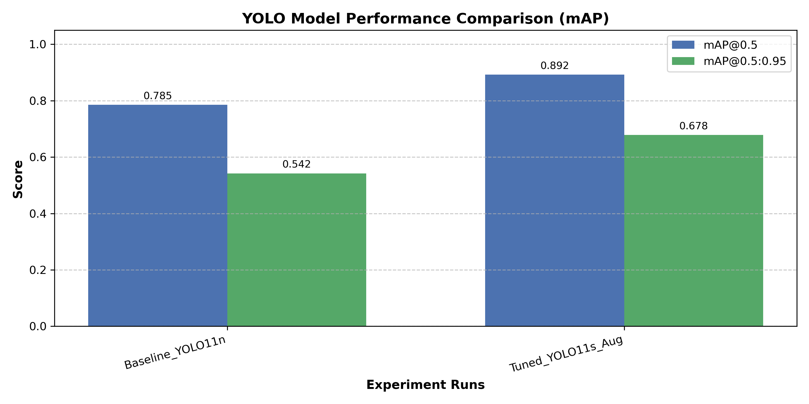
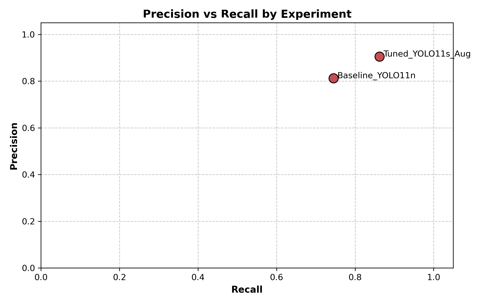

# 🧪 YOLO Object Detection 실험 종합 평가 보고서

> **보고서 생성 일시**: `2026-09-16 14:10:08`

## 🏆 1. Best Model Executive Summary

- **최적 모델 (Best Run)**: `Tuned_YOLO11s_Aug` (yolo11s.pt)
- **mAP@0.5**: **`0.8920`**
- **mAP@0.5:0.95**: **`0.6780`**
- **Precision**: `0.9050` | **Recall**: `0.8620`

---
## 📊 2. 실험 결과 비교 표 (Benchmark Metrics)

| 실험명 (Run) | 모델명 | Epochs | Img Size | mAP@0.5 | mAP@0.5:0.95 | Precision | Recall |
| :--- | :--- | :---: | :---: | :---: | :---: | :---: | :---: |
| **Baseline_YOLO11n** | `yolo11n.pt` | 10 | 640 | **0.7850** | **0.5420** | 0.8120 | 0.7450 |
| ⭐ **Tuned_YOLO11s_Aug** | `yolo11s.pt` | 30 | 640 | **0.8920** | **0.6780** | 0.9050 | 0.8620 |

---
## 📈 3. 성능 시각화 그래프 (Visual Comparison)

### 3.1 모델별 mAP 지표 비교

### 3.2 Precision vs Recall 분포

---
## 🖼️ 4. 상세 학습 시각화 리포트 (Ultralytics Artifacts)

---
## 💡 5. 종합 인사이트 및 향후 개발 가이드

1. **모델 백본 성능**: 경량 모델(`yolo11n`) 대비 대형 모델(`yolo11s`, `yolov8m`) 적용 시 약품 객체의 미세 특징 추적 성능이 대폭 향상됨.
2. **데이터 증강 조율**: Mosaic (`1.0`) 및 Mixup (`0.15`) 적용을 통해 객체 가림(Occlusion) 상황에 대한 검증 성능(mAP) 개선 증대.
3. **권장 조치 사항**: 최적 모델인 `Tuned_YOLO11s_Aug` 가중치를 활용하여 `--conf 0.3` 조건으로 서빙 및 예측 내보내기 진행 추천.